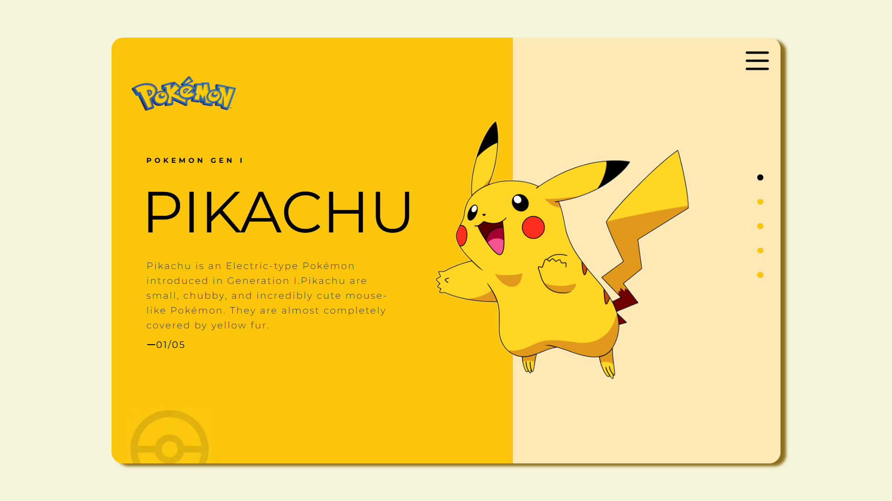

# Pokemon Information - Pikachu Card

A simple, visually appealing static web page showcasing information about the Generation I Pokémon, Pikachu. 

## 🚀 How to Run the Project Locally

Since this is a static project built with plain HTML and CSS, no complex environment setup or installation is required. You can run it directly in your web browser.

### VS Code

In Visual Studio Code and want to view changes in real-time or avoid CORS issues with certain assets:

1. Open the project folder in **Visual Studio Code**.
2. Open the `index.html` file in VS Code.
3. Click on the **"Go Live"** button at the bottom right corner of the VS Code window, or right-click anywhere in the `index.html` file and select **"Open with Live Server"**.
4. Your default web browser will automatically open and display the project.

## 🛠️ Built With

* HTML5
* CSS3

## 📁 File Structure

* `index.html`: The main HTML document containing the structure of the Pikachu card.
* `style.css`: The stylesheet containing the visual design and layout.
* `images/`: Directory containing the image assets (logos, Pikachu, pokeball, etc.) used in the project.

## 📸 Preview

